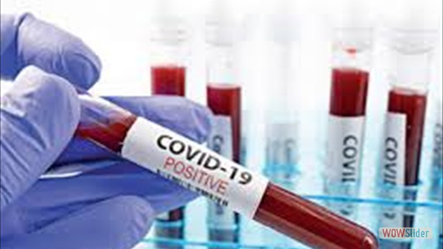
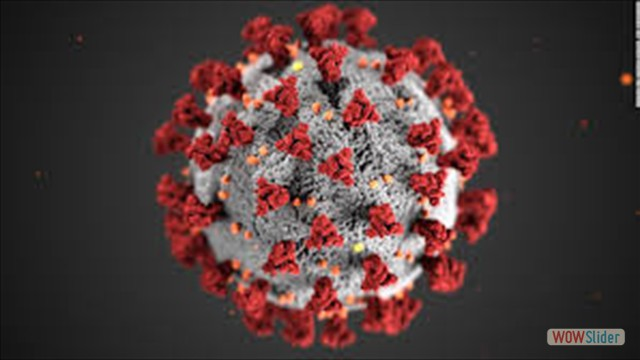

<!doctype html>

<html lang="en">
<head>

	<meta http-equiv="content-type" content="text/html; charset=utf-8" />
	<meta name="description" content="Made with WOW Slider - Create beautiful, responsive image sliders in a few clicks. Awesome skins and animations. Bootstrap carousel example" />
	
	<!-- Start WOWSlider.com HEAD section --> <!-- add to the <head> of your page -->
	<link rel="stylesheet" type="text/css" href="engine1/style.css" />
	
	<!-- End WOWSlider.com HEAD section -->

  <meta charset="utf-8">

  <title>Covid 19</title>
  <meta name="description" content="The HTML5 Herald">
  <meta name="author" content="SitePoint">

  <link rel="stylesheet" href="interstyle.css">

</head>
<header class="header">
    <h1 class="logo"><a href="#">Covid 19</a></h1>
  <ul class="main-nav">
      <li><a href="index.php">Home</a></li>
      <li><a href="statistics.php">Statistics</a></li>
      <li><a href="symptoms.php">Symptoms</a></li>
      <li><a href="precautions.php">Precautions</a></li>
  </ul>
</header> 

<body style="background-color:black;">

<!-- Start WOWSlider.com BODY section --> <!-- add to the <body> of your page -->
	

	
<ul>
		<li></li>
		<li></li>
		<li></li>
		<li></li>
	</ul>

	

		<a href="#" title="corona1jpg">1</a>
		<a href="#" title="corona2">2</a>
		<a href="#" title="corona3">3</a>
		<a href="#" title="corona5">4</a>
	

<a href="http://wowslider.net">bootstrap carousel example</a> by WOWSlider.com v8.8

	

	
	
	
	
	<!-- End WOWSlider.com BODY section -->

    <section>
   
        

            Covid 19 : India Overview    

    

    <centre>
	<table class="content-table">
        <thread>
            <tr class="special">
                <th>Country</th>
                <th>Total Cases</th>
                <th>Active Cases</th>
                <th>Total Recovered</th>
                <th>Deaths</th>
            </tr>
        </thread>

	<?php 
$cn=mysqli_connect("localhost","root","","covid19");
if(!$cn)
{
	echo "Unable to connect";
	die();
}
$sql="select * from overall";

//Fetch data
$result=mysqli_query($cn,$sql);

//Check number of rows
$n=mysqli_num_rows($result);

if($n>0)
{
	//show data
	while($rw=mysqli_fetch_array($result))
	{
		$a=$rw["Country"];
		$b=$rw["Total Cases"];
		$c=$rw["Active Cases"];
		$d=$rw["Recovered"];
		$e=$rw["Deaths"];
		if($a=="India")
		{
	?>

    
            <tbody>
            <tr>
                <td><?php echo $a; ?></td>
                <td><?php echo $b; ?></td>
                <td><?php echo $c; ?></td>
                <td><?php echo $d; ?></td>
                <td><?php echo $e; ?></td>
            </tr>
 <?php
		}
		
	}
	
	
}
?>
</tbody>
</table>
			

    <table class="content-table">
        <thread>
            <tr class="special">
                <th>State/Union Teritorry</th>
                <th>Total Cases</th>
                <th>Active Cases</th>
                <th>Total Recovered</th>
                <th>Deaths</th>
            </tr>
        </thread>

	<?php 
$cn=mysqli_connect("localhost","root","","covid19");
if(!$cn)
{
	echo "Unable to connect";
	die();
}
$sql="select * from cases";

//Fetch data
$result=mysqli_query($cn,$sql);

//Check number of rows
$n=mysqli_num_rows($result);

if($n>0)
{
	//show data
	while($rw=mysqli_fetch_array($result))
	{
		$a=$rw["State"];
		$b=$rw["Total Cases"];
		$c=$rw["Active Cases"];
		$d=$rw["Recovered"];
		$e=$rw["Deaths"];
		if($a=="Maharashtra")
		{
	?>

    
            <tbody>
            <tr>
                <td><?php echo $a; ?></td>
                <td><?php echo $b; ?></td>
                <td><?php echo $c; ?></td>
                <td><?php echo $d; ?></td>
                <td><?php echo $e; ?></td>
            </tr>
 <?php
		}
		
	}
	
	
}
?>           
	<?php 
$cn=mysqli_connect("localhost","root","","covid19");
if(!$cn)
{
	echo "Unable to connect";
	die();
}
$sql="select * from cases";

//Fetch data
$result=mysqli_query($cn,$sql);

//Check number of rows
$n=mysqli_num_rows($result);

if($n>0)
{
	//show data
	while($rw=mysqli_fetch_array($result))
	{
		$a=$rw["State"];
		$b=$rw["Total Cases"];
		$c=$rw["Active Cases"];
		$d=$rw["Recovered"];
		$e=$rw["Deaths"];
		if($a=="Gujarat")
		{
	?>

    
            <tbody>
            <tr>
                <td><?php echo $a; ?></td>
                <td><?php echo $b; ?></td>
                <td><?php echo $c; ?></td>
                <td><?php echo $d; ?></td>
                <td><?php echo $e; ?></td>
            </tr>
 <?php
		}
		
	}
	
	
}
?>
	<?php 
$cn=mysqli_connect("localhost","root","","covid19");
if(!$cn)
{
	echo "Unable to connect";
	die();
}
$sql="select * from cases";

//Fetch data
$result=mysqli_query($cn,$sql);

//Check number of rows
$n=mysqli_num_rows($result);

if($n>0)
{
	//show data
	while($rw=mysqli_fetch_array($result))
	{
		$a=$rw["State"];
		$b=$rw["Total Cases"];
		$c=$rw["Active Cases"];
		$d=$rw["Recovered"];
		$e=$rw["Deaths"];
		if($a=="Tamil nadu")
		{
	?>

    
            <tbody>
            <tr>
                <td><?php echo $a; ?></td>
                <td><?php echo $b; ?></td>
                <td><?php echo $c; ?></td>
                <td><?php echo $d; ?></td>
                <td><?php echo $e; ?></td>
            </tr>
 <?php
		}
		
	}
	
	
}
?>           
           
	<?php 
$cn=mysqli_connect("localhost","root","","covid19");
if(!$cn)
{
	echo "Unable to connect";
	die();
}
$sql="select * from cases";

//Fetch data
$result=mysqli_query($cn,$sql);

//Check number of rows
$n=mysqli_num_rows($result);

if($n>0)
{
	//show data
	while($rw=mysqli_fetch_array($result))
	{
		$a=$rw["State"];
		$b=$rw["Total Cases"];
		$c=$rw["Active Cases"];
		$d=$rw["Recovered"];
		$e=$rw["Deaths"];
		if($a=="Rajasthan")
		{
	?>

    
            <tbody>
            <tr>
                <td><?php echo $a; ?></td>
                <td><?php echo $b; ?></td>
                <td><?php echo $c; ?></td>
                <td><?php echo $d; ?></td>
                <td><?php echo $e; ?></td>
            </tr>
 <?php
		}
		
	}
	
	
}
?>           
            
	<?php 
$cn=mysqli_connect("localhost","root","","covid19");
if(!$cn)
{
	echo "Unable to connect";
	die();
}
$sql="select * from cases";

//Fetch data
$result=mysqli_query($cn,$sql);

//Check number of rows
$n=mysqli_num_rows($result);

if($n>0)
{
	//show data
	while($rw=mysqli_fetch_array($result))
	{
		$a=$rw["State"];
		$b=$rw["Total Cases"];
		$c=$rw["Active Cases"];
		$d=$rw["Recovered"];
		$e=$rw["Deaths"];
		if($a=="Delhi")
		{
	?>

    
            <tbody>
            <tr>
                <td><?php echo $a; ?></td>
                <td><?php echo $b; ?></td>
                <td><?php echo $c; ?></td>
                <td><?php echo $d; ?></td>
                <td><?php echo $e; ?></td>
            </tr>
 <?php
		}
		
	}
	
	
}
?>           
            
	<?php 
$cn=mysqli_connect("localhost","root","","covid19");
if(!$cn)
{
	echo "Unable to connect";
	die();
}
$sql="select * from cases";

//Fetch data
$result=mysqli_query($cn,$sql);

//Check number of rows
$n=mysqli_num_rows($result);

if($n>0)
{
	//show data
	while($rw=mysqli_fetch_array($result))
	{
		$a=$rw["State"];
		$b=$rw["Total Cases"];
		$c=$rw["Active Cases"];
		$d=$rw["Recovered"];
		$e=$rw["Deaths"];
		if($a=="Madhya Pradesh")
		{
	?>

    
            <tbody>
            <tr>
                <td><?php echo $a; ?></td>
                <td><?php echo $b; ?></td>
                <td><?php echo $c; ?></td>
                <td><?php echo $d; ?></td>
                <td><?php echo $e; ?></td>
            </tr>
 <?php
		}
		
	}
	
	
}
?>           
            
	<?php 
$cn=mysqli_connect("localhost","root","","covid19");
if(!$cn)
{
	echo "Unable to connect";
	die();
}
$sql="select * from cases";

//Fetch data
$result=mysqli_query($cn,$sql);

//Check number of rows
$n=mysqli_num_rows($result);

if($n>0)
{
	//show data
	while($rw=mysqli_fetch_array($result))
	{
		$a=$rw["State"];
		$b=$rw["Total Cases"];
		$c=$rw["Active Cases"];
		$d=$rw["Recovered"];
		$e=$rw["Deaths"];
		if($a=="Uttar Pradesh")
		{
	?>

    
            <tbody>
            <tr>
                <td><?php echo $a; ?></td>
                <td><?php echo $b; ?></td>
                <td><?php echo $c; ?></td>
                <td><?php echo $d; ?></td>
                <td><?php echo $e; ?></td>
            </tr>
 <?php
		}
		
	}
	
	
}
?>           
            
	<?php 
$cn=mysqli_connect("localhost","root","","covid19");
if(!$cn)
{
	echo "Unable to connect";
	die();
}
$sql="select * from cases";

//Fetch data
$result=mysqli_query($cn,$sql);

//Check number of rows
$n=mysqli_num_rows($result);

if($n>0)
{
	//show data
	while($rw=mysqli_fetch_array($result))
	{
		$a=$rw["State"];
		$b=$rw["Total Cases"];
		$c=$rw["Active Cases"];
		$d=$rw["Recovered"];
		$e=$rw["Deaths"];
		if($a=="West Bengal")
		{
	?>

    
            <tbody>
            <tr>
                <td><?php echo $a; ?></td>
                <td><?php echo $b; ?></td>
                <td><?php echo $c; ?></td>
                <td><?php echo $d; ?></td>
                <td><?php echo $e; ?></td>
            </tr>
 <?php
		}
		
	}
	
	
}
?>

	<?php 
$cn=mysqli_connect("localhost","root","","covid19");
if(!$cn)
{
	echo "Unable to connect";
	die();
}
$sql="select * from cases";

//Fetch data
$result=mysqli_query($cn,$sql);

//Check number of rows
$n=mysqli_num_rows($result);

if($n>0)
{
	//show data
	while($rw=mysqli_fetch_array($result))
	{
		$a=$rw["State"];
		$b=$rw["Total Cases"];
		$c=$rw["Active Cases"];
		$d=$rw["Recovered"];
		$e=$rw["Deaths"];
		if($a=="Andhra Pradesh")
		{
	?>

    
            <tbody>
            <tr>
                <td><?php echo $a; ?></td>
                <td><?php echo $b; ?></td>
                <td><?php echo $c; ?></td>
                <td><?php echo $d; ?></td>
                <td><?php echo $e; ?></td>
            </tr>
 <?php
		}
		
	}
	
	
}
?>           
      
	<?php 
$cn=mysqli_connect("localhost","root","","covid19");
if(!$cn)
{
	echo "Unable to connect";
	die();
}
$sql="select * from cases";

//Fetch data
$result=mysqli_query($cn,$sql);

//Check number of rows
$n=mysqli_num_rows($result);

if($n>0)
{
	//show data
	while($rw=mysqli_fetch_array($result))
	{
		$a=$rw["State"];
		$b=$rw["Total Cases"];
		$c=$rw["Active Cases"];
		$d=$rw["Recovered"];
		$e=$rw["Deaths"];
		if($a=="Bihar")
		{
	?>

    
            <tbody>
            <tr>
                <td><?php echo $a; ?></td>
                <td><?php echo $b; ?></td>
                <td><?php echo $c; ?></td>
                <td><?php echo $d; ?></td>
                <td><?php echo $e; ?></td>
            </tr>
 <?php
		}
		
	}
	
	
}
?>      
      
	<?php 
$cn=mysqli_connect("localhost","root","","covid19");
if(!$cn)
{
	echo "Unable to connect";
	die();
}
$sql="select * from cases";

//Fetch data
$result=mysqli_query($cn,$sql);

//Check number of rows
$n=mysqli_num_rows($result);

if($n>0)
{
	//show data
	while($rw=mysqli_fetch_array($result))
	{
		$a=$rw["State"];
		$b=$rw["Total Cases"];
		$c=$rw["Active Cases"];
		$d=$rw["Recovered"];
		$e=$rw["Deaths"];
		if($a=="Karnataka")
		{
	?>

    
            <tbody>
            <tr>
                <td><?php echo $a; ?></td>
                <td><?php echo $b; ?></td>
                <td><?php echo $c; ?></td>
                <td><?php echo $d; ?></td>
                <td><?php echo $e; ?></td>
            </tr>
 <?php
		}
		
	}
	
	
}
?>      

	<?php 
$cn=mysqli_connect("localhost","root","","covid19");
if(!$cn)
{
	echo "Unable to connect";
	die();
}
$sql="select * from cases";

//Fetch data
$result=mysqli_query($cn,$sql);

//Check number of rows
$n=mysqli_num_rows($result);

if($n>0)
{
	//show data
	while($rw=mysqli_fetch_array($result))
	{
		$a=$rw["State"];
		$b=$rw["Total Cases"];
		$c=$rw["Active Cases"];
		$d=$rw["Recovered"];
		$e=$rw["Deaths"];
		if($a=="Punjab")
		{
	?>

    
            <tbody>
            <tr>
                <td><?php echo $a; ?></td>
                <td><?php echo $b; ?></td>
                <td><?php echo $c; ?></td>
                <td><?php echo $d; ?></td>
                <td><?php echo $e; ?></td>
            </tr>
 <?php
		}
		
	}
	
	
}
?>

	<?php 
$cn=mysqli_connect("localhost","root","","covid19");
if(!$cn)
{
	echo "Unable to connect";
	die();
}
$sql="select * from cases";

//Fetch data
$result=mysqli_query($cn,$sql);

//Check number of rows
$n=mysqli_num_rows($result);

if($n>0)
{
	//show data
	while($rw=mysqli_fetch_array($result))
	{
		$a=$rw["State"];
		$b=$rw["Total Cases"];
		$c=$rw["Active Cases"];
		$d=$rw["Recovered"];
		$e=$rw["Deaths"];
		if($a=="Telangana")
		{
	?>

    
            <tbody>
            <tr>
                <td><?php echo $a; ?></td>
                <td><?php echo $b; ?></td>
                <td><?php echo $c; ?></td>
                <td><?php echo $d; ?></td>
                <td><?php echo $e; ?></td>
            </tr>
 <?php
		}
		
	}
	
	
}
?>

	<?php 
$cn=mysqli_connect("localhost","root","","covid19");
if(!$cn)
{
	echo "Unable to connect";
	die();
}
$sql="select * from cases";

//Fetch data
$result=mysqli_query($cn,$sql);

//Check number of rows
$n=mysqli_num_rows($result);

if($n>0)
{
	//show data
	while($rw=mysqli_fetch_array($result))
	{
		$a=$rw["State"];
		$b=$rw["Total Cases"];
		$c=$rw["Active Cases"];
		$d=$rw["Recovered"];
		$e=$rw["Deaths"];
		if($a=="Jammu and Kashmir")
		{
	?>

    
            <tbody>
            <tr>
                <td><?php echo $a; ?></td>
                <td><?php echo $b; ?></td>
                <td><?php echo $c; ?></td>
                <td><?php echo $d; ?></td>
                <td><?php echo $e; ?></td>
            </tr>
 <?php
		}
		
	}
	
	
}
?>

	<?php 
$cn=mysqli_connect("localhost","root","","covid19");
if(!$cn)
{
	echo "Unable to connect";
	die();
}
$sql="select * from cases";

//Fetch data
$result=mysqli_query($cn,$sql);

//Check number of rows
$n=mysqli_num_rows($result);

if($n>0)
{
	//show data
	while($rw=mysqli_fetch_array($result))
	{
		$a=$rw["State"];
		$b=$rw["Total Cases"];
		$c=$rw["Active Cases"];
		$d=$rw["Recovered"];
		$e=$rw["Deaths"];
		if($a=="Odisha")
		{
	?>

    
            <tbody>
            <tr>
                <td><?php echo $a; ?></td>
                <td><?php echo $b; ?></td>
                <td><?php echo $c; ?></td>
                <td><?php echo $d; ?></td>
                <td><?php echo $e; ?></td>
            </tr>
 <?php
		}
		
	}
	
	
}
?>

	<?php 
$cn=mysqli_connect("localhost","root","","covid19");
if(!$cn)
{
	echo "Unable to connect";
	die();
}
$sql="select * from cases";

//Fetch data
$result=mysqli_query($cn,$sql);

//Check number of rows
$n=mysqli_num_rows($result);

if($n>0)
{
	//show data
	while($rw=mysqli_fetch_array($result))
	{
		$a=$rw["State"];
		$b=$rw["Total Cases"];
		$c=$rw["Active Cases"];
		$d=$rw["Recovered"];
		$e=$rw["Deaths"];
		if($a=="Haryana")
		{
	?>

    
            <tbody>
            <tr>
                <td><?php echo $a; ?></td>
                <td><?php echo $b; ?></td>
                <td><?php echo $c; ?></td>
                <td><?php echo $d; ?></td>
                <td><?php echo $e; ?></td>
            </tr>
 <?php
		}
		
	}
	
	
}
?>

<?php 
$cn=mysqli_connect("localhost","root","","covid19");
if(!$cn)
{
	echo "Unable to connect";
	die();
}
$sql="select * from cases";

//Fetch data
$result=mysqli_query($cn,$sql);

//Check number of rows
$n=mysqli_num_rows($result);

if($n>0)
{
	//show data
	while($rw=mysqli_fetch_array($result))
	{
		$a=$rw["State"];
		$b=$rw["Total Cases"];
		$c=$rw["Active Cases"];
		$d=$rw["Recovered"];
		$e=$rw["Deaths"];
		if($a=="kerala")
		{
	?>

    
            <tbody>
            <tr>
                <td><?php echo $a; ?></td>
                <td><?php echo $b; ?></td>
                <td><?php echo $c; ?></td>
                <td><?php echo $d; ?></td>
                <td><?php echo $e; ?></td>
            </tr>
 <?php
		}
		
	}
	
	
}
?>

<?php 
$cn=mysqli_connect("localhost","root","","covid19");
if(!$cn)
{
	echo "Unable to connect";
	die();
}
$sql="select * from cases";

//Fetch data
$result=mysqli_query($cn,$sql);

//Check number of rows
$n=mysqli_num_rows($result);

if($n>0)
{
	//show data
	while($rw=mysqli_fetch_array($result))
	{
		$a=$rw["State"];
		$b=$rw["Total Cases"];
		$c=$rw["Active Cases"];
		$d=$rw["Recovered"];
		$e=$rw["Deaths"];
		if($a=="Assam")
		{
	?>

    
            <tbody>
            <tr>
                <td><?php echo $a; ?></td>
                <td><?php echo $b; ?></td>
                <td><?php echo $c; ?></td>
                <td><?php echo $d; ?></td>
                <td><?php echo $e; ?></td>
            </tr>
 <?php
		}
		
	}
	
	
}
?>

<?php 
$cn=mysqli_connect("localhost","root","","covid19");
if(!$cn)
{
	echo "Unable to connect";
	die();
}
$sql="select * from cases";

//Fetch data
$result=mysqli_query($cn,$sql);

//Check number of rows
$n=mysqli_num_rows($result);

if($n>0)
{
	//show data
	while($rw=mysqli_fetch_array($result))
	{
		$a=$rw["State"];
		$b=$rw["Total Cases"];
		$c=$rw["Active Cases"];
		$d=$rw["Recovered"];
		$e=$rw["Deaths"];
		if($a=="Jharkhand")
		{
	?>

    
            <tbody>
            <tr>
                <td><?php echo $a; ?></td>
                <td><?php echo $b; ?></td>
                <td><?php echo $c; ?></td>
                <td><?php echo $d; ?></td>
                <td><?php echo $e; ?></td>
            </tr>
 <?php
		}
		
	}
	
	
}
?>

<?php 
$cn=mysqli_connect("localhost","root","","covid19");
if(!$cn)
{
	echo "Unable to connect";
	die();
}
$sql="select * from cases";

//Fetch data
$result=mysqli_query($cn,$sql);

//Check number of rows
$n=mysqli_num_rows($result);

if($n>0)
{
	//show data
	while($rw=mysqli_fetch_array($result))
	{
		$a=$rw["State"];
		$b=$rw["Total Cases"];
		$c=$rw["Active Cases"];
		$d=$rw["Recovered"];
		$e=$rw["Deaths"];
		if($a=="Uttarkhand")
		{
	?>

    
            <tbody>
            <tr>
                <td><?php echo $a; ?></td>
                <td><?php echo $b; ?></td>
                <td><?php echo $c; ?></td>
                <td><?php echo $d; ?></td>
                <td><?php echo $e; ?></td>
            </tr>
 <?php
		}
		
	}
	
	
}
?>

<?php 
$cn=mysqli_connect("localhost","root","","covid19");
if(!$cn)
{
	echo "Unable to connect";
	die();
}
$sql="select * from cases";

//Fetch data
$result=mysqli_query($cn,$sql);

//Check number of rows
$n=mysqli_num_rows($result);

if($n>0)
{
	//show data
	while($rw=mysqli_fetch_array($result))
	{
		$a=$rw["State"];
		$b=$rw["Total Cases"];
		$c=$rw["Active Cases"];
		$d=$rw["Recovered"];
		$e=$rw["Deaths"];
		if($a=="Chattisgarh")
		{
	?>

    
            <tbody>
            <tr>
                <td><?php echo $a; ?></td>
                <td><?php echo $b; ?></td>
                <td><?php echo $c; ?></td>
                <td><?php echo $d; ?></td>
                <td><?php echo $e; ?></td>
            </tr>
 <?php
		}
		
	}
	
	
}
?>

<?php 
$cn=mysqli_connect("localhost","root","","covid19");
if(!$cn)
{
	echo "Unable to connect";
	die();
}
$sql="select * from cases";

//Fetch data
$result=mysqli_query($cn,$sql);

//Check number of rows
$n=mysqli_num_rows($result);

if($n>0)
{
	//show data
	while($rw=mysqli_fetch_array($result))
	{
		$a=$rw["State"];
		$b=$rw["Total Cases"];
		$c=$rw["Active Cases"];
		$d=$rw["Recovered"];
		$e=$rw["Deaths"];
		if($a=="Chandigarh")
		{
	?>

    
            <tbody>
            <tr>
                <td><?php echo $a; ?></td>
                <td><?php echo $b; ?></td>
                <td><?php echo $c; ?></td>
                <td><?php echo $d; ?></td>
                <td><?php echo $e; ?></td>
            </tr>
 <?php
		}
		
	}
	
	
}
?>

<?php 
$cn=mysqli_connect("localhost","root","","covid19");
if(!$cn)
{
	echo "Unable to connect";
	die();
}
$sql="select * from cases";

//Fetch data
$result=mysqli_query($cn,$sql);

//Check number of rows
$n=mysqli_num_rows($result);

if($n>0)
{
	//show data
	while($rw=mysqli_fetch_array($result))
	{
		$a=$rw["State"];
		$b=$rw["Total Cases"];
		$c=$rw["Active Cases"];
		$d=$rw["Recovered"];
		$e=$rw["Deaths"];
		if($a=="Himachal Pradesh")
		{
	?>

    
            <tbody>
            <tr>
                <td><?php echo $a; ?></td>
                <td><?php echo $b; ?></td>
                <td><?php echo $c; ?></td>
                <td><?php echo $d; ?></td>
                <td><?php echo $e; ?></td>
            </tr>
 <?php
		}
		
	}
	
	
}
?>

<?php 
$cn=mysqli_connect("localhost","root","","covid19");
if(!$cn)
{
	echo "Unable to connect";
	die();
}
$sql="select * from cases";

//Fetch data
$result=mysqli_query($cn,$sql);

//Check number of rows
$n=mysqli_num_rows($result);

if($n>0)
{
	//show data
	while($rw=mysqli_fetch_array($result))
	{
		$a=$rw["State"];
		$b=$rw["Total Cases"];
		$c=$rw["Active Cases"];
		$d=$rw["Recovered"];
		$e=$rw["Deaths"];
		if($a=="Tripura")
		{
	?>

    
            <tbody>
            <tr>
                <td><?php echo $a; ?></td>
                <td><?php echo $b; ?></td>
                <td><?php echo $c; ?></td>
                <td><?php echo $d; ?></td>
                <td><?php echo $e; ?></td>
            </tr>
 <?php
		}
		
	}
	
	
}
?>

<?php 
$cn=mysqli_connect("localhost","root","","covid19");
if(!$cn)
{
	echo "Unable to connect";
	die();
}
$sql="select * from cases";

//Fetch data
$result=mysqli_query($cn,$sql);

//Check number of rows
$n=mysqli_num_rows($result);

if($n>0)
{
	//show data
	while($rw=mysqli_fetch_array($result))
	{
		$a=$rw["State"];
		$b=$rw["Total Cases"];
		$c=$rw["Active Cases"];
		$d=$rw["Recovered"];
		$e=$rw["Deaths"];
		if($a=="Goa")
		{
	?>

    
            <tbody>
            <tr>
                <td><?php echo $a; ?></td>
                <td><?php echo $b; ?></td>
                <td><?php echo $c; ?></td>
                <td><?php echo $d; ?></td>
                <td><?php echo $e; ?></td>
            </tr>
 <?php
		}
		
	}
	
	
}
?>

<?php 
$cn=mysqli_connect("localhost","root","","covid19");
if(!$cn)
{
	echo "Unable to connect";
	die();
}
$sql="select * from cases";

//Fetch data
$result=mysqli_query($cn,$sql);

//Check number of rows
$n=mysqli_num_rows($result);

if($n>0)
{
	//show data
	while($rw=mysqli_fetch_array($result))
	{
		$a=$rw["State"];
		$b=$rw["Total Cases"];
		$c=$rw["Active Cases"];
		$d=$rw["Recovered"];
		$e=$rw["Deaths"];
		if($a=="Ladakh")
		{
	?>

    
            <tbody>
            <tr>
                <td><?php echo $a; ?></td>
                <td><?php echo $b; ?></td>
                <td><?php echo $c; ?></td>
                <td><?php echo $d; ?></td>
                <td><?php echo $e; ?></td>
            </tr>
 <?php
		}
		
	}
	
	
}
?>

<?php 
$cn=mysqli_connect("localhost","root","","covid19");
if(!$cn)
{
	echo "Unable to connect";
	die();
}
$sql="select * from cases";

//Fetch data
$result=mysqli_query($cn,$sql);

//Check number of rows
$n=mysqli_num_rows($result);

if($n>0)
{
	//show data
	while($rw=mysqli_fetch_array($result))
	{
		$a=$rw["State"];
		$b=$rw["Total Cases"];
		$c=$rw["Active Cases"];
		$d=$rw["Recovered"];
		$e=$rw["Deaths"];
		if($a=="Puducherry")
		{
	?>

    
            <tbody>
            <tr>
                <td><?php echo $a; ?></td>
                <td><?php echo $b; ?></td>
                <td><?php echo $c; ?></td>
                <td><?php echo $d; ?></td>
                <td><?php echo $e; ?></td>
            </tr>
 <?php
		}
		
	}
	
	
}
?>

<?php 
$cn=mysqli_connect("localhost","root","","covid19");
if(!$cn)
{
	echo "Unable to connect";
	die();
}
$sql="select * from cases";

//Fetch data
$result=mysqli_query($cn,$sql);

//Check number of rows
$n=mysqli_num_rows($result);

if($n>0)
{
	//show data
	while($rw=mysqli_fetch_array($result))
	{
		$a=$rw["State"];
		$b=$rw["Total Cases"];
		$c=$rw["Active Cases"];
		$d=$rw["Recovered"];
		$e=$rw["Deaths"];
		if($a=="Manipur")
		{
	?>

    
            <tbody>
            <tr>
                <td><?php echo $a; ?></td>
                <td><?php echo $b; ?></td>
                <td><?php echo $c; ?></td>
                <td><?php echo $d; ?></td>
                <td><?php echo $e; ?></td>
            </tr>
 <?php
		}
		
	}
	
	
}
?>

<?php 
$cn=mysqli_connect("localhost","root","","covid19");
if(!$cn)
{
	echo "Unable to connect";
	die();
}
$sql="select * from cases";

//Fetch data
$result=mysqli_query($cn,$sql);

//Check number of rows
$n=mysqli_num_rows($result);

if($n>0)
{
	//show data
	while($rw=mysqli_fetch_array($result))
	{
		$a=$rw["State"];
		$b=$rw["Total Cases"];
		$c=$rw["Active Cases"];
		$d=$rw["Recovered"];
		$e=$rw["Deaths"];
		if($a=="Andaman and Nicobar Islands")
		{
	?>

    
            <tbody>
            <tr>
                <td><?php echo $a; ?></td>
                <td><?php echo $b; ?></td>
                <td><?php echo $c; ?></td>
                <td><?php echo $d; ?></td>
                <td><?php echo $e; ?></td>
            </tr>
 <?php
		}
		
	}
	
	
}
?>

<?php 
$cn=mysqli_connect("localhost","root","","covid19");
if(!$cn)
{
	echo "Unable to connect";
	die();
}
$sql="select * from cases";

//Fetch data
$result=mysqli_query($cn,$sql);

//Check number of rows
$n=mysqli_num_rows($result);

if($n>0)
{
	//show data
	while($rw=mysqli_fetch_array($result))
	{
		$a=$rw["State"];
		$b=$rw["Total Cases"];
		$c=$rw["Active Cases"];
		$d=$rw["Recovered"];
		$e=$rw["Deaths"];
		if($a=="Meghalaya")
		{
	?>

    
            <tbody>
            <tr>
                <td><?php echo $a; ?></td>
                <td><?php echo $b; ?></td>
                <td><?php echo $c; ?></td>
                <td><?php echo $d; ?></td>
                <td><?php echo $e; ?></td>
            </tr>
 <?php
		}
		
	}
	
	
}
?>

<?php 
$cn=mysqli_connect("localhost","root","","covid19");
if(!$cn)
{
	echo "Unable to connect";
	die();
}
$sql="select * from cases";

//Fetch data
$result=mysqli_query($cn,$sql);

//Check number of rows
$n=mysqli_num_rows($result);

if($n>0)
{
	//show data
	while($rw=mysqli_fetch_array($result))
	{
		$a=$rw["State"];
		$b=$rw["Total Cases"];
		$c=$rw["Active Cases"];
		$d=$rw["Recovered"];
		$e=$rw["Deaths"];
		if($a=="Nagaland")
		{
	?>

    
            <tbody>
            <tr>
                <td><?php echo $a; ?></td>
                <td><?php echo $b; ?></td>
                <td><?php echo $c; ?></td>
                <td><?php echo $d; ?></td>
                <td><?php echo $e; ?></td>
            </tr>
 <?php
		}
		
	}
	
	
}
?>

<?php 
$cn=mysqli_connect("localhost","root","","covid19");
if(!$cn)
{
	echo "Unable to connect";
	die();
}
$sql="select * from cases";

//Fetch data
$result=mysqli_query($cn,$sql);

//Check number of rows
$n=mysqli_num_rows($result);

if($n>0)
{
	//show data
	while($rw=mysqli_fetch_array($result))
	{
		$a=$rw["State"];
		$b=$rw["Total Cases"];
		$c=$rw["Active Cases"];
		$d=$rw["Recovered"];
		$e=$rw["Deaths"];
		if($a=="Dadra and nagar")
		{
	?>

    
            <tbody>
            <tr>
                <td><?php echo $a; ?></td>
                <td><?php echo $b; ?></td>
                <td><?php echo $c; ?></td>
                <td><?php echo $d; ?></td>
                <td><?php echo $e; ?></td>
            </tr>
 <?php
		}
		
	}
	
	
}
?>

<?php 
$cn=mysqli_connect("localhost","root","","covid19");
if(!$cn)
{
	echo "Unable to connect";
	die();
}
$sql="select * from cases";

//Fetch data
$result=mysqli_query($cn,$sql);

//Check number of rows
$n=mysqli_num_rows($result);

if($n>0)
{
	//show data
	while($rw=mysqli_fetch_array($result))
	{
		$a=$rw["State"];
		$b=$rw["Total Cases"];
		$c=$rw["Active Cases"];
		$d=$rw["Recovered"];
		$e=$rw["Deaths"];
		if($a=="Arunachal Pradesh")
		{
	?>

    
            <tbody>
            <tr>
                <td><?php echo $a; ?></td>
                <td><?php echo $b; ?></td>
                <td><?php echo $c; ?></td>
                <td><?php echo $d; ?></td>
                <td><?php echo $e; ?></td>
            </tr>
 <?php
		}
		
	}
	
	
}
?>

<?php 
$cn=mysqli_connect("localhost","root","","covid19");
if(!$cn)
{
	echo "Unable to connect";
	die();
}
$sql="select * from cases";

//Fetch data
$result=mysqli_query($cn,$sql);

//Check number of rows
$n=mysqli_num_rows($result);

if($n>0)
{
	//show data
	while($rw=mysqli_fetch_array($result))
	{
		$a=$rw["State"];
		$b=$rw["Total Cases"];
		$c=$rw["Active Cases"];
		$d=$rw["Recovered"];
		$e=$rw["Deaths"];
		if($a=="Mizoram")
		{
	?>

    
            <tbody>
            <tr>
                <td><?php echo $a; ?></td>
                <td><?php echo $b; ?></td>
                <td><?php echo $c; ?></td>
                <td><?php echo $d; ?></td>
                <td><?php echo $e; ?></td>
            </tr>
 <?php
		}
		
	}
	
	
}
?>

<?php 
$cn=mysqli_connect("localhost","root","","covid19");
if(!$cn)
{
	echo "Unable to connect";
	die();
}
$sql="select * from cases";

//Fetch data
$result=mysqli_query($cn,$sql);

//Check number of rows
$n=mysqli_num_rows($result);

if($n>0)
{
	//show data
	while($rw=mysqli_fetch_array($result))
	{
		$a=$rw["State"];
		$b=$rw["Total Cases"];
		$c=$rw["Active Cases"];
		$d=$rw["Recovered"];
		$e=$rw["Deaths"];
		if($a=="Sikkim")
		{
	?>

    
            <tbody>
            <tr>
                <td><?php echo $a; ?></td>
                <td><?php echo $b; ?></td>
                <td><?php echo $c; ?></td>
                <td><?php echo $d; ?></td>
                <td><?php echo $e; ?></td>
            </tr>
 <?php
		}
		
	}
	
	
}
?>
        </tbody>
    </table>
    
    
    <?php
$cn=mysqli_connect("localhost","root","","covid19");
if(!$cn)
{
	echo "Unable to connect";
	die();
}
$sql="select * from cities";

//Fetch data
$result=mysqli_query($cn,$sql);
?>

    
    
    
    
    </centre>
</section>

    

      

      
      <!--  for company name and description -->
        

            <h1>Covid 19</h1>
            

          

      
      <!--  for quick links  -->
          

            <h3>Quick Links</h3>
            

 <!--for the underline -->
              <ul>
                <a href="#"><li>Home</li></a>
                <a href="#"><li>Statistics</li></a>
                <a href="#"><li>Symptoms</li></a>
                <a href="#"><li>Precautions</li></a>
              </ul>
          

      
            
      <!--  for contact us info -->
          

            <h3>Contact us</h3>
            

              <ul>
                <li><i class="fa fa-map-marker" aria-hidden="true"></i>Gulab Jamun</li>
                <li><i class="fa fa-phone" aria-hidden="true"></i>9636381012</li>
                <li><i class="fa fa-envelope" aria-hidden="true"></i>kunaljain2608@gmail.com</li>
              </ul> 
            
      <!--   for social links -->
              

                <a href="#"><i class="fab fa-instagram"></i></a>
                <a href="#"><i class="fab fa-facebook"></i></a>
                <a href="#"><i class="fab fa-google-plus-square"></i></a>
              
 
          

        

        
      <!--   Footer Bottom start  -->
        

          Copyright &copy; The Covid19 Page.
        

      

        
        
      </body>  
    
</body>
</html>
